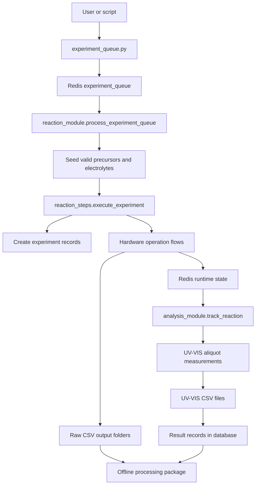

# Autoammonia Architecture

This document describes the high-level architecture of `autoammonia`, a Python package for automated ammonia electrochemistry experiments. The system coordinates hardware, experiment queues, workflow orchestration, database persistence, and post-experiment processing across one or more lab setups.

## Design Goals

- Keep experiment logic hardware-agnostic by addressing devices through configured component names.
- Support multiple physical setups with setup-specific TOML configuration.
- Coordinate distributed modules through Redis and Prefect rather than direct process coupling.
- Store experiment metadata and output file references in PostgreSQL through SQLAlchemy.
- Keep raw hardware control, workflow orchestration, and offline processing as separate layers.

## Technology Stack

- Python package using a `src` layout.
- Prefect for flows, tasks, deployments, retries, and orchestration.
- Redis for queues, locks, stop flags, runtime state, and cross-module coordination.
- PostgreSQL with SQLAlchemy ORM for persistent experiment metadata.
- TOML files for setup, component, connection, and default parameter configuration.
- Pandas, NumPy, SciPy, and Matplotlib for data processing and plotting.
- Hardware-specific libraries for pumps, valves, potentiostats, spectrometers, and lamps, with mock replacements in simulation mode.

## Repository Layout

- `src/autoammonia/config/`: setup detection and TOML configuration loading.
- `src/autoammonia/hardware/`: hardware operation wrappers for pumps, valves, potentiostats, UV-VIS, and lamps.
- `src/autoammonia/hardware/mock/`: mock classes used when `AUTOAMMONIA_SIMULATION=true`.
- `src/autoammonia/db/`: SQLAlchemy models, session management, database helper tasks, and table scripts.
- `src/autoammonia/prefect_deploy/`: scripts for creating and triggering Prefect deployments.
- `src/autoammonia/processing/`: offline analysis, Faradaic efficiency calculations, UV-VIS plots, electrochemical summaries, and experiment reports.
- `src/autoammonia/utils/`: shared helpers for Redis, decorators, dynamic imports, files, Prefect utilities, and precursor/electrolyte discovery.
- `src/autoammonia/scripts/`: operational lab scripts for calibration, leak checks, and compartment handling.
- `src/autoammonia/testing/`: manually triggered hardware and reaction test entry points.
- `tests/`: pytest-based service, hardware, and integration checks.
- `tests_old/`: archived older test suite.

## Runtime Modules

### Experiment Queue

`src/autoammonia/experiment_queue.py` is the user-facing queue entry point. It reads desired precursor and electrolyte compositions, validates them against currently configured valid compounds, creates all requested experiment combinations, and pushes each experiment into the Redis `experiment_queue` list.

The console script is:

```bash
autoammonia_exp_requester
```

### Reaction Module

`src/autoammonia/reaction_module.py` contains the main reaction worker flow:

- `process_experiment_queue()` initializes Redis runtime state and Prefect variables.
- It optionally clears the previous Redis queue.
- It waits until enough tasks exist for the configured `parallel_cells`.
- It pops experiments from Redis using `fetch_task_from_redis()`.
- It seeds valid precursors and electrolytes into the database.
- It calls `execute_experiment()` from `reaction_steps.py`.

This module is deployed with the `autoammonia_deploy_reaction`, `autoammonia_deploy_reaction_mock`, or `autoammonia_deploy_reaction_sim` console scripts.

### Reaction Steps

`src/autoammonia/reaction_steps.py` holds the main experimental protocol. `execute_experiment()` creates experiment records, records runtime metadata in Redis, creates data folders, and runs the configured sequence:

1. `electrodeposition()`: prepares metal precursor solutions, fills cell compartments, runs CP methods in parallel, and washes cells.
2. `electrosynthesis()`: prepares catholyte/anolyte, optionally performs pre-reaction characterization, runs the reaction CP method, optionally performs post-reaction characterization, and washes cells.
3. `electrodissolution()`: fills cells with acid/anolyte, runs OCP dissolution, and washes cells.

Supporting flows include `initialize_pump()`, `restore_pump()`, `wash_flow_cell()`, `empty_and_stop_pumps()`, `prepare_elyte_mix()`, and `characterization()`.

### Analysis Module

`src/autoammonia/analysis_module.py` runs alongside the reaction module. Its main flow, `track_reaction()`, watches the Redis `reaction_status` key. When a reaction starts, it schedules aliquot collection with `take_aliquots()`, mixes aliquots with detection reagents, measures them with `measure_vial()`, writes UV-VIS CSV files, and stores result file records in the database.

The analysis flow is deployed with `autoammonia_deploy_analysis`, `autoammonia_deploy_analysis_mock`, or `autoammonia_deploy_analysis_sim`.

### Safety Module

`src/autoammonia/safety_module_peri.py` monitors safety-related Redis state. `track_safety()` watches the `safety_operation` flag and triggers emergency emptying/cleanup when unsafe operation is detected. `pumps_safety_check()` compares expected peristaltic pump state in Redis with actual pump status and attempts recovery when needed.

### Processing Layer

The `src/autoammonia/processing/` package is offline-oriented. It consumes CSV outputs and database metadata to generate derived summaries and plots:

- `fe.py`, `fe_calc.py`, and `fe_summary_plot.py` calculate and visualize Faradaic efficiency and absorbance behavior.
- `uvvis_gaussian_fit_plot.py` and `uvvis_multiplot.py` generate UV-VIS visualizations.
- `single_experiment_summary.py` builds combined experiment summary figures.
- `electrochemical_characterization_summary.py` summarizes CV, LSV, ECSA, applied potential, and measured current traces.
- `currents.py` summarizes current deviations from CP files.
- `plots.py` contains lower-level electrochemical plotting helpers.

## Runtime Flow

The normal deployed workflow is:



The deployment trigger script starts the primary long-running modules together:

```text
process-experiment-queue/reaction_module_flow
track-safety/safety_module_flow
track-reaction/analysis_module_flow
```

## Detailed Experiment Lifecycle

An experiment batch is normally processed in groups of `parallel_cells`. Each item in the Redis queue contains a precursor composition and an electrolyte composition. The reaction worker waits until it can build a full batch, then treats the batch as one coordinated physical run across the available cells.

The lifecycle is:

1. Queue creation:
   - `request_experiments()` discovers valid precursors and electrolytes from the configured connection map.
   - User input is normalized into lists of `(name, ratio)` tuples.
   - Every precursor/electrolyte combination is pushed to Redis under `experiment_queue`.

2. Queue consumption:
   - `process_experiment_queue()` initializes Redis state through `client_initialization()`.
   - It optionally deletes any previous `experiment_queue`.
   - It repeatedly calls `fetch_task_from_redis()` until `parallel_cells` experiments are available.
   - It writes valid precursor and electrolyte reference rows to the database before executing the batch.

3. Experiment registration:
   - `execute_experiment()` creates one `Experiment` row per cell with cell metadata.
   - It writes cell-to-experiment mappings such as `WEvial01_EXP_ID` to Redis.
   - It records composition snapshots in Redis with keys such as `ID{exp_id}_catholyte` and `ID{exp_id}_metal_ratios`.
   - It creates output folders for electrodeposition, electrosynthesis, electrodissolution, and UV-VIS data.

4. Electrodeposition:
   - Metal precursor ratios are mapped to configured stock ports.
   - `prepare_elyte_mix()` prepares the precursor solution in each working electrode vial.
   - The counter electrode vial is filled with anolyte.
   - Peristaltic pumps start flow through the cells.
   - `run_method_parallel()` runs potentiostat CP methods concurrently across cells.
   - Cell content state is updated and the flow cell is washed.

5. Electrosynthesis:
   - Catholyte and anolyte compartments are prepared for each cell.
   - Optional pre-reaction characterization runs OCP, CV, and LSV methods.
   - The Redis `reaction_status` key is set to the reaction duration, which signals the analysis module to schedule aliquots.
   - The reaction CP method runs in parallel across cells.
   - Optional post-reaction characterization runs after the reaction.
   - `reaction_status` returns to `waiting`, and cells are washed unless the step is ignored.

6. Analysis during reaction:
   - `track_reaction()` waits until `reaction_status` contains a reaction duration.
   - It schedules aliquot events using `asyncio`.
   - Each aliquot claims one vial from `empty_vials`, transfers sample from the working electrode vial, adds detection reagents, waits for the configured dark time, then calls `measure_vial()`.
   - `measure_vial()` acquires reference, dark, and sample spectra, computes transmittance and absorption columns, writes a UV-VIS CSV, records a `Result` row, washes the vial, and returns it to `empty_vials`.

7. Electrodissolution:
   - Cells are filled with acid and anolyte.
   - Peristaltic pumps start flow.
   - OCP dissolution is recorded with the potentiostats.
   - Cells are washed at the end of the step.

8. Offline processing:
   - Processing scripts read raw CSV files and database metadata after acquisition.
   - Summary figures, FE calculations, UV-VIS plots, characterization summaries, and current deviation reports are generated without controlling hardware.

Several reaction steps accept `ignore_steps`, allowing developers to skip parts of the protocol during debugging or partial runs. Because Redis and database state are shared across modules, skipped steps should still leave any downstream state they depend on in a consistent form.

## Configuration Architecture

Configuration is loaded at import time from `src/autoammonia/config/config.py`.

Setup detection follows this priority:

1. Use `AUTOAMMONIA_SETUP` if set.
2. Match the hostname against `setup_mappings.toml`.
3. Fall back to the default setup declared in `setup_mappings.toml`, currently Toronto if no explicit default is present.

Default parameter selection follows this priority:

1. `default_config_sim.toml` when `AUTOAMMONIA_SIMULATION=true`.
2. `default_config_mock.toml` when `AUTOAMMONIA_MOCK_CONFIG=true`.
3. `default_config_{setup}.toml` for normal operation.

Setup-specific hardware and port configuration is split across:

- `components_{setup}.toml`: component classes, connection parameters, addresses, and device-specific construction settings.
- `connections_info_{setup}.toml`: port names, port numbers, connection volumes, stock usage, and active setup components.
- `setup_mappings.toml`: hostname-to-setup mapping.

See `src/autoammonia/config/README.md` for detailed instructions on adding or modifying setups.

### Configuration Data Contracts

The configuration layer has three distinct responsibilities:

- `DEFAULT_CONFIG` defines runtime parameters such as timings, speeds, retry counts, reaction currents, volumes, data paths, and safety limits.
- `CONNECTIONS_INFO` describes the physical liquid-handling topology: which named ports exist, which are stocks, which compartments are connected, and what connection volumes should be considered.
- `CONFIG_COMPONENTS` describes how to instantiate devices: class paths, COM ports, addresses, syringe volumes, nested device classes, and mock substitutions.

Most runtime functions merge defaults with call-time keyword overrides using:

```python
config = {**DEFAULT_CONFIG, **kwargs}
```

This makes small experiments and tests configurable without changing the TOML files, while keeping production defaults centralized. Because configuration is loaded at import time, environment variables that select setup or simulation mode must be set before importing modules that depend on `DEFAULT_CONFIG` or `CONFIG_COMPONENTS`.

Component and connection files are intentionally separate. A pump can exist as a device in `components_{setup}.toml`, while its liquid-handling ports and stock assignments live in `connections_info_{setup}.toml`. The component loader enriches component configs with port information when a matching connection entry exists.

## Hardware Abstraction

Experiment code refers to hardware by component name, for example `tecanRX01`, `longerWE01`, `potentiostat01`, `UVVIS01`, or `lamp01`. The component name is resolved through TOML configuration and the decorators in `src/autoammonia/utils/decorators.py`.

The main decorators are:

- `run_on_component()`: converts a component name into a lazily instantiated device object.
- `with_lock()`: acquires a Redis lock around a component-scoped function.
- `run_on_component_with_lock()`: combines lazy component instantiation and Redis locking.

Instances are cached in-process after first use. Component classes are imported dynamically using the configured class path, which allows the same orchestration code to use real hardware or mocks.

When `AUTOAMMONIA_SIMULATION=true`, `src/autoammonia/config/components_config.py` replaces supported real hardware classes with mock classes from `src/autoammonia/hardware/mock/`.

### Decorator Code Snapshots

The decorators in `src/autoammonia/utils/decorators.py` are the bridge between architecture and hardware execution. These trimmed snapshots show the core pattern without the full docstrings.

`acquire_lock()` creates the Redis lock name from the component name and extends the lock for the expected function duration:

```python
def acquire_lock(component_name: str, function_timeout: int, acquisition_timeout: int, function: Callable) -> redis.lock:
    lock_name = f"{component_name}_lock"
    ini_time = time.time()
    lock = client.lock(lock_name, timeout=acquisition_timeout)
    if lock.acquire(blocking=True):
        acquisition_time = time.time() - ini_time
        lock.extend(additional_time=function_timeout + acquisition_time)
        return lock
    raise LockError(f"Could not acquire lock for {component_name}. Another process is blocking it.")
```

`get_or_create_component_instance()` lazily resolves the configured class path, builds the component once, and reuses it inside the current process:

```python
def get_or_create_component_instance(component_name: str):
    if component_name not in _component_instances:
        all_configs = get_config_components()
        component_info = all_configs[component_name].copy()
        component_class = resolve_class(component_info.pop("class"))

        if "device_class" in component_info:
            device_class = resolve_class(component_info.pop("device_class"))
            device_kwargs = component_info.pop("device_kwargs", {})
            device = device_class(**device_kwargs)
            _component_instances[component_name] = component_class(device, **component_info)
        else:
            _component_instances[component_name] = component_class(**component_info)

    return _component_instances[component_name]
```

`run_on_component()` converts a component name such as `tecanRX01` into the configured component object before calling the original function:

```python
def run_on_component():
    def decorator(func):
        @wraps(func)
        def wrapper(component_name: str, *args, **kwargs):
            component = get_or_create_component_instance(component_name)
            return func(component, *args, **kwargs)

        return wrapper

    return decorator
```

`with_lock()` keeps the first argument as the component name, but guarantees exclusive access while the wrapped function runs:

```python
def with_lock(function_timeout: Optional[int] = None, acquisition_timeout: Optional[int] = None):
    config = {**DEFAULT_CONFIG}
    function_timeout = function_timeout if function_timeout is not None else config["function_timeout"]
    acquisition_timeout = acquisition_timeout if acquisition_timeout is not None else config["acquisition_timeout"]

    def decorator(func):
        @wraps(func)
        def wrapper(component_name: str, *args, **kwargs):
            lock = acquire_lock(component_name, function_timeout, acquisition_timeout, func)
            try:
                return func(component_name, *args, **kwargs)
            finally:
                if lock.owned():
                    lock.release()

        return wrapper

    return decorator
```

`run_on_component_with_lock()` is the hardware-operation default: instantiate the component, acquire its Redis lock, call the operation, and release the lock:

```python
def run_on_component_with_lock(function_timeout: Optional[int] = None, acquisition_timeout: Optional[int] = None):
    config = {**DEFAULT_CONFIG}
    function_timeout = function_timeout if function_timeout is not None else config["function_timeout"]
    acquisition_timeout = acquisition_timeout if acquisition_timeout is not None else config["acquisition_timeout"]

    def decorator(func):
        @wraps(func)
        def wrapper(component_name: str, *args, **kwargs):
            component = get_or_create_component_instance(component_name)
            lock = acquire_lock(component_name, function_timeout, acquisition_timeout, func)
            try:
                return func(component, *args, **kwargs)
            finally:
                if lock.owned():
                    lock.release()

        return wrapper

    return decorator
```

### Component Resolution Sequence

When a decorated hardware task receives a component name, the resolution path is:

1. Load raw setup-specific component configuration from `components_{ACTIVE_SETUP}.toml`.
2. Apply mock class overrides if simulation mode is active.
3. Add configured port mappings from `CONNECTIONS_INFO`.
4. Resolve the configured class path with `utils.importing.resolve_class()`.
5. Resolve and instantiate any nested `device_class` first, when present.
6. Instantiate the component class with the remaining TOML parameters.
7. Store the resulting object in the process-local `_component_instances` cache.
8. Pass the object into the original task function.

This means hardware is lazily initialized on first use rather than at process startup. It also means each worker process has its own component cache; Redis locks, not the local cache, are what protect shared physical hardware across processes.

### Concurrency And Locking

There are three layers of concurrency control:

- Prefect controls task and flow execution.
- `asyncio` is used for operations such as parallel potentiostat methods and scheduled aliquot collection.
- Redis locks provide cross-process exclusive access to individual hardware components.

The lock name is derived from the component name, for example `tecanRX01_lock` or `potentiostat01_lock`. `with_lock()` is used when a function only needs a component-scoped lock. `run_on_component_with_lock()` is used when the function also needs the component instance. Long-running operations extend the lock timeout based on the expected function duration, such as an electrochemical method duration.

New hardware-facing code should follow the same pattern:

- Use component names at the orchestration boundary.
- Acquire a Redis lock for any operation that touches physical hardware.
- Keep lock timeouts aligned with the longest expected hardware action.
- Prefer small task functions that wrap a single physical device operation.
- Let higher-level flows compose those tasks into experimental protocols.

## Hardware Operation Layer

The hardware package exposes workflow-friendly operations rather than raw device APIs:

- `hardware/syringe_pumps.py`: draw, dispense, transfer, wash, compartment fill, volume tracking, retry handling, and valve routing.
- `hardware/peristaltic_pumps.py`: run, stop, and check peristaltic pumps.
- `hardware/selection_valves.py`: switch valve ports.
- `hardware/potentiostat.py`: run electrochemical methods and parallelize measurements across cells.
- `hardware/uv_vis_module.py`: switch lamps, acquire spectra, and package UV-VIS data as dataframes.
- `hardware/uv_vis_lamp.py`: lamp device implementations.

These functions are generally Prefect tasks or flows and use Redis locks where exclusive hardware access is required.

### Liquid-Handling Model

Liquid-handling code is built around named compartments and ports rather than hardcoded valve positions. A transfer operation usually receives names such as `water`, `anolyte`, `WEvial01`, `CEvial01`, `waste`, or `uv_vis`. The implementation resolves whether the name is directly on the syringe pump or behind an attached valve using `CONNECTIONS_INFO`.

Common patterns are:

- Draw and dispense operations are split into smaller iterations when the requested volume exceeds syringe capacity.
- Wash operations are wrappers around repeated transfer, emptying, and flushing steps.
- Redis volume keys such as `WEvial01_volume` and `CEvial01_volume` track expected compartment contents.
- Peristaltic pump state is written to Redis so the safety module can compare expected and actual pump status.

This model keeps protocol code readable while preserving enough physical detail for tubing volumes, stock solution routing, and wash procedures.

### Electrochemical Measurements

Potentiostat methods are dispatched by `hardware/potentiostat.py`.

- `run_echem_method()` wraps a single potentiostat method under a component lock.
- `run_method_parallel()` creates one task per configured cell and awaits all methods together.
- Filenames include the database experiment ID, cell number, method name, and optional suffix.
- The reaction steps use CP for deposition and reaction, OCP for dissolution, and OCP/CV/LSV for characterization.

The protocol treats potentiostat files as raw artifacts. Database rows and Redis state connect those files back to experiment IDs and compositions.

### UV-VIS Measurements

UV-VIS acquisition is split between the hardware and analysis layers:

- `hardware/uv_vis_module.py` controls lamp switching and spectrometer acquisition.
- `analysis_module.py` handles aliquot transfer, reagent mixing, timing, spectrum composition, CSV writing, database result insertion, and vial cleanup.

For each measured aliquot, the analysis module records reference dark, reference, sample dark, and sample intensities. It then derives corrected intensities, transmittance, and absorption before writing the CSV.

## Redis Responsibilities

Redis is the runtime coordination layer. It is used for:

- `experiment_queue`: pending experiment requests.
- Component locks named from component identifiers.
- Stop and safety flags such as `stop_signal` and `safety_operation`.
- Reaction state such as `reaction_status`.
- Vial and cell state such as empty vial lists, cell contents, compartment volumes, and experiment IDs assigned to vials.
- Data folder paths and host information shared between reaction and analysis modules.
- Expected pump status for safety monitoring.

`src/autoammonia/utils/redis_client.py` provides a lazily initialized Redis client and the `client_initialization()` routine that resets runtime state at the beginning of a queue-processing run.

### Important Redis Keys

The architectural point is that Redis is live coordination state. It is not the permanent experiment record.

```text
                         REDIS: live coordination layer
                         ==============================

  User/requester                 Reaction flow                  Analysis flow
       |                              |                              |
       | lpush experiment_queue       | lpop experiment_queue        |
       +----------------------------->+------------------------------+
                                      |
                                      | set reaction_status
                                      | set WEvial{cell}_EXP_ID
                                      | set WEvial{cell}_volume
                                      | set flow_cell{cell}_content
                                      v
                         +----------------------------+
                         | Runtime keys               |
                         |----------------------------|
  queued work            | experiment_queue           |  What is queued?
  reaction timing        | reaction_status            |  Observed by analysis
  safety state           | safety_operation           |  Observed by safety
  hardware locks         | {component_name}_lock      |  Used for locking
  vial availability      | empty_vials                |  Used by analysis
  cell/vial assignment   | WEvial{cell}_EXP_ID        |  Runtime only
  compartment estimate   | WEvial{cell}_volume        |  Runtime only
  flow-cell content      | flow_cell{cell}_content    |  Runtime only
                         +----------------------------+
                                      ^
                                      |
                Safety flow observes safety_operation and pump state
                Hardware tasks acquire {component_name}_lock keys
```

Key roles:

- `experiment_queue`: queued experiment requests waiting for the reaction module.
- `reaction_status`: runtime signal used by the analysis module to schedule aliquots.
- `safety_operation`: runtime safety flag watched by the safety module.
- `{component_name}_lock`: Redis lock key used to prevent concurrent access to one hardware component.
- `empty_vials`: runtime list of analysis vials available for aliquot collection.
- `WEvial{cell}_EXP_ID`, `WEvial{cell}_volume`, and `flow_cell{cell}_content`: cell/vial state used to synchronize flows without shared memory.

Redis values are runtime state, not durable experiment records. Durable metadata belongs in PostgreSQL, and raw traces belong in CSV output folders.

## Database Architecture

The database layer lives in `src/autoammonia/db/` and uses SQLAlchemy ORM with PostgreSQL.

Main models in `models.py` are:

- `Experiment`: a single experiment run with timestamp, notes, and metadata.
- `Precursor` and `Electrolyte`: reference tables for valid materials.
- `CatalystComposition` and `ElectrolyteComposition`: links from experiments to material proportions.
- `Config` and `ExperimentConfig`: versioned configuration records and experiment-to-config links.
- `Result`: output file references and result metadata.

`db_functions.py` exposes Prefect tasks for seeding valid materials, creating experiments, and adding result records. `db.py` provides a lazy session proxy around the configured database URL.

See `src/autoammonia/db/database.md` for database setup and table management details.

### Database Write Points

The runtime writes to the database at a few explicit boundaries:

- Before processing a batch, `add_valid_electrolytes_and_metals_to_db()` inserts configured materials into `Precursor` and `Electrolyte` reference tables using conflict-safe inserts.
- At the start of `execute_experiment()`, `add_experiment_to_db()` creates one `Experiment` row per cell and links its catalyst and electrolyte compositions.
- During UV-VIS analysis, `add_results_to_db()` inserts one `Result` row per generated UV-VIS CSV.

The database does not currently own the live queue, locks, vial state, or pump state. Those remain in Redis because they are transient operational concerns.

### Durable Record Layer

PostgreSQL and files are the durable layer. PostgreSQL stores experiment identity, compositions, and file references. CSV files store the raw instrument traces and spectra.

```text
              POSTGRESQL: durable metadata             FILE SYSTEM: durable raw data
              ==============================           =============================

  reaction_steps.execute_experiment()
              |
              | add_experiment_to_db()
              v
      +--------------------+
      | experiments        |
      |--------------------|
      | id                 |
      | date               |
      | notes              |
      | exp_metadata       |
      +---------+----------+
                |
                +---- catalyst_compositions ---> precursors
                |
                +---- electrolyte_compositions -> electrolytes
                |
                +---- experiment_config --------> configs
                |
                | add_results_to_db()
                v
      +--------------------+       file_path        +-----------------------------+
      | results            |----------------------->| electrodeposition/*.csv     |
      |--------------------|                        | electrosynthesis/*.csv      |
      | experiment_id      |                        | electrodissolution/*.csv    |
      | result_type        |                        | UVVIS/*.csv or uvvis/*.csv  |
      | result_role        |                        +-----------------------------+
      | file_path          |
      | results_metadata   |
      +--------------------+
```

- `Experiment` is the root record for a run in one physical cell.
- `CatalystComposition` links an experiment to one or more `Precursor` rows with proportions.
- `ElectrolyteComposition` links an experiment to one or more `Electrolyte` rows with proportions.
- `Result` links generated files to an experiment with type, role, description, and metadata.
- `Config` and `ExperimentConfig` provide a place to store and link versioned configuration snapshots.

This structure allows multiple result files and multiple composition components to attach to the same experiment without duplicating experiment metadata.

## Data And File Outputs

`src/autoammonia/utils/files.py` creates output folders using `get_default_folder()`. The selected base path comes from configuration and depends on whether the current host is the main experiment host. If no configured base path is available, it falls back to `~/ammonia_data`.

Experiments create separate measurement folders for:

- `electrodeposition`
- `electrosynthesis`
- `electrodissolution`
- `uvvis`

Raw instrument CSV files are written to these folders. Database `Result` rows store file paths and metadata so downstream processing can connect records to generated data.

### File Naming And Folder Conventions

Electrochemical filenames are generated by `run_method_parallel()` and include:

- Experiment ID.
- Cell number.
- Method name, such as `CP`, `OCP`, `CV`, or `LSV`.
- Optional suffixes such as `prerx`, `postrx`, or an ECSA scan-rate label.

UV-VIS files are named with:

- Experiment ID.
- Reaction time at aliquot collection.
- Vial name.

The reaction module records data paths in Redis using lowercase measurement names such as `data_path_uvvis`. The current UV-VIS acquisition path is created with `get_default_folder('UVVIS')`, so consumers should be aware of folder-case differences on case-sensitive filesystems.

Raw CSV outputs should be treated as immutable. Processing scripts should write new summary outputs rather than modifying acquisition files in place.

### Host-Aware Data Handling

The system records `main_hostname` and `main_os` in Redis at experiment start. `get_default_folder()` chooses between configured host and non-host base paths. `transfer_file_scp()` exists for moving files back to the main host when acquisition happens elsewhere, although current UV-VIS result insertion keeps the local path unless remote transfer is enabled.

## Prefect Deployments And Entrypoints

Console scripts are declared in `pyproject.toml`. The most important operational entry points are:

- `autoammonia_deploy_reaction`: deploy reaction flows.
- `autoammonia_deploy_reaction_mock`: deploy reaction flows with mock configuration.
- `autoammonia_deploy_reaction_sim`: deploy reaction flows in simulation mode.
- `autoammonia_deploy_analysis`: deploy analysis flows.
- `autoammonia_deploy_analysis_mock`: deploy analysis flows with mock configuration.
- `autoammonia_deploy_analysis_sim`: deploy analysis flows in simulation mode.
- `autoammonia_run`: trigger reaction, analysis, and safety deployments together.
- `autoammonia_exp_requester`: request experiments and enqueue them in Redis.
- `autoammonia_calibrate`, `autoammonia_calibrate_manual`, and `autoammonia_calibrate_sim`: run calibration workflows.
- `autoammonia_db_create_tables`, `autoammonia_db_test`, and `autoammonia_db_drop_tables`: database maintenance commands.

Simulation mode is also available through `src/autoammonia/simulation_entrypoints.py`, which sets `AUTOAMMONIA_SIMULATION=true` before importing the main flows.

### Deployment Modes

The deployment scripts separate runtime intent:

- Production deployment uses setup-specific real configuration and real hardware classes.
- Mock configuration deployment keeps real component classes but uses fast timing and test-oriented defaults from `default_config_mock.toml`.
- Simulation deployment sets `AUTOAMMONIA_SIMULATION=true`, which loads `default_config_sim.toml` and swaps supported hardware classes for mocks.

This distinction matters because simulation mode changes both timings and hardware classes, while mock configuration only changes the selected default parameters.

### Long-Running Process Boundaries

The system is designed around multiple independently running flows:

- The reaction flow owns queue consumption and physical experiment execution.
- The analysis flow observes reaction status and handles aliquot/UV-VIS work.
- The safety flow observes safety flags and hardware state.

These flows communicate through Redis. They should not depend on each other's in-memory state because they may run in different processes or on different machines.

## Testing Strategy

The active pytest suite is under `tests/`.

- `tests/hardware/` contains hardware smoke tests, service checks, and system integrity checks.
- `tests/integration/` contains integration utilities for electrochemical behavior.
- Pytest markers include `hardware`, `integration`, and `unit`.

Hardware tests are expected to need physical devices or running services. Unit and integration tests can use mock or simulation configuration by setting the relevant environment variables before importing package modules.

### Practical Test Boundaries

Tests should be grouped by what they require:

- Unit tests should avoid real Redis, PostgreSQL, Prefect workers, and hardware where possible.
- Integration tests may require Redis or database connectivity but should avoid physical devices unless marked.
- Hardware tests should be explicitly marked with `hardware` and should assume setup-specific component configuration.
- Service tests can verify Redis, database, queue, and Prefect availability before running full workflows.

Because many modules read environment variables at import time, test fixtures should set `AUTOAMMONIA_SIMULATION`, `AUTOAMMONIA_MOCK_CONFIG`, or `AUTOAMMONIA_SETUP` before importing modules that load configuration.

## Extension Points

To add a new physical setup:

1. Add hostname mappings to `setup_mappings.toml`.
2. Add `components_{setup}.toml`.
3. Add `connections_info_{setup}.toml`.
4. Add `default_config_{setup}.toml`.
5. Keep component names aligned with reaction and analysis code expectations, especially pump, valve, potentiostat, vial, and UV-VIS names.

To add new hardware:

1. Add a device class path and construction parameters in `components_{setup}.toml`.
2. Add port and usage information in `connections_info_{setup}.toml` if the device participates in liquid handling.
3. Wrap device operations in `src/autoammonia/hardware/` functions using the existing decorators.
4. Add mock support in `hardware/mock/` and `MOCK_OVERRIDES` if the device should work in simulation.

To add a new experimental step:

1. Implement the step as a Prefect flow in `reaction_steps.py` or a dedicated module.
2. Use configured defaults from `DEFAULT_CONFIG` with keyword overrides.
3. Use component names rather than constructing hardware directly.
4. Record runtime state in Redis when the analysis or safety modules need to observe it.
5. Store persistent metadata and output file references through database helper tasks.

To add new processing:

1. Read raw files through paths or database `Result` records.
2. Keep calculations independent from hardware modules.
3. Preserve raw acquisition files and write derived outputs separately.
4. Reuse common plotting and electrochemical conversion helpers from `processing/plots.py` where possible.
5. Store references to important processed artifacts in the database if they need to be discoverable later.

To add new shared runtime state:

1. Prefer Redis for transient coordination and PostgreSQL for durable records.
2. Use predictable key names that include cell, vial, component, or experiment ID when relevant.
3. Initialize keys in `client_initialization()` if they are required before a run starts.
4. Document any key that is shared across modules.
5. Avoid relying on local process globals for cross-flow behavior.

## Failure Handling And Safety

The architecture assumes hardware actions can fail and that failures should leave the system in a recoverable state when possible.

Important safety mechanisms are:

- Redis locks prevent concurrent access to the same configured component.
- Pump functions write expected state to Redis for monitoring.
- Hardware wrappers use retry logic around operations that are expected to occasionally fail.
- Several failure paths set `safety_operation` to `0`, which is watched by the safety flow.
- `track_safety()` attempts to empty and stop the flow cells using configured emergency retry settings.
- `process_experiment_queue()` can be stopped with `stop_signal`.

When adding failure handling, prefer making the state transition explicit. For example, update Redis when a compartment changes content, record files in the database only after they are written, and let exceptions propagate through Prefect when an operation cannot be safely completed.

## Architectural Boundaries

The project works best when modules keep these responsibilities separate:

- Configuration modules load setup-specific facts and defaults.
- Hardware modules translate component names and operation parameters into physical actions.
- Reaction flows decide experimental order and protocol state.
- Analysis flows observe reaction state and collect derived measurements during the run.
- Safety flows monitor runtime state and recover from unsafe conditions.
- Database modules persist durable metadata and file references.
- Processing modules transform completed acquisition artifacts into summaries.

Code that crosses these boundaries should do so deliberately. For example, reaction code can call database helper tasks to register experiments, but low-level hardware wrappers should not make experiment design decisions.

## Operational Notes

- Many modules load configuration at import time, so environment variables such as `AUTOAMMONIA_SETUP`, `AUTOAMMONIA_SIMULATION`, and `AUTOAMMONIA_MOCK_CONFIG` should be set before importing `autoammonia` modules.
- Redis locks are central to safe hardware sharing. New hardware operations should use the existing decorator pattern unless they are intentionally lock-free.
- The database stores metadata and file references, not raw instrument traces.
- Offline processing scripts should treat raw CSV outputs as immutable experiment artifacts.
- The current architecture expects stable component naming conventions for parallel cells, vials, pumps, and potentiostats.
